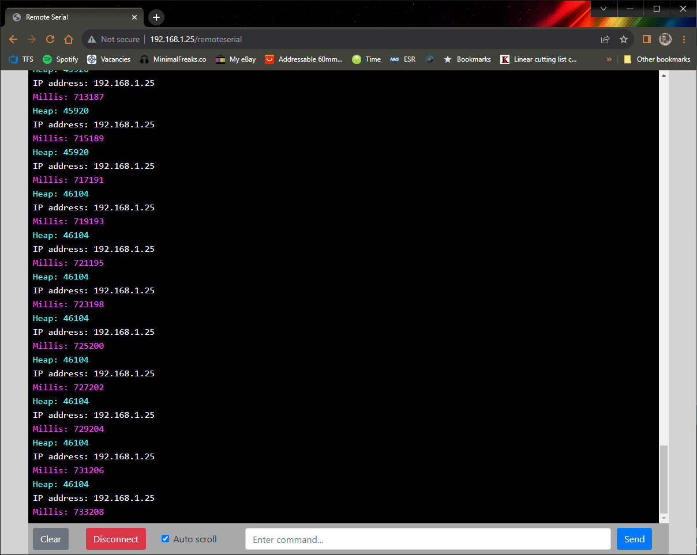

# Remote Serial Library

RemoteSerial is a web-based serial console designed for ESP8266 & ESP32 allowing easy debugging, monitoring and control.

## Preview

## Features

- Uses websockets
- Realtime logging and remote control
- Supports multiple clients
- Web console supports ANSI colours and formatting

## Dependencies

For ESP8266:

- ESP8266 Arduino Core
- ESPAsyncTCP
- ESPAsyncWebServer

For ESP32:

- ESP32 Arduino Core
- AsyncTCP
- ESPAsyncWebServer

## Installation

### Using The Arduino IDE

Go to `Sketch > Include Library > Library Manager > Search` for `RemoteSerial > Install`

### Manual Install

For Windows: Download the Repository and extract the .zip in `Documents > Arduino > Libraries > {place "RemoteSerial" folder Here}`

For Linux: Download the Repository and extract the .zip in `Sketchbook > Libraries > {place "RemoteSerial" folder Here}`

Insstall these libraries too:

- https://github.com/me-no-dev/ESPAsyncWebServer
- https://github.com/me-no-dev/AsyncTCP

### Manually using IDE

Download the Repository, Go to `Sketch > Include Library > Add .zip Library > Select the Downloaded .zip file.`

## Documentation

The RemoteSerial object works very much like Serial object used in the Arduino eco system.

Please look at the basic demo [here](./examples/Basic/Basic.ino) to see how to use it.

There are 3 main function

`print`
`println`
`printf`

`print` - transmits data to the RemoteSerial console without appending any newline character.
`println` - same as above but adds a newline character at the end.
`printf` - transmits formatted text to the RemoteSerial console.  You can control the formatting of variables like numbers, strings, and other data types, including specifying the number of decimal places, padding with zeros, and more.

You may also output [ANSI colour codes](https://talyian.github.io/ansicolors/) that will appear in the console as formatted text.

## Remote Serial Console

To access the console: Go to `<IP Address>/remoteserial` in your browser, where `<IP Address>` is the IP of your device.
